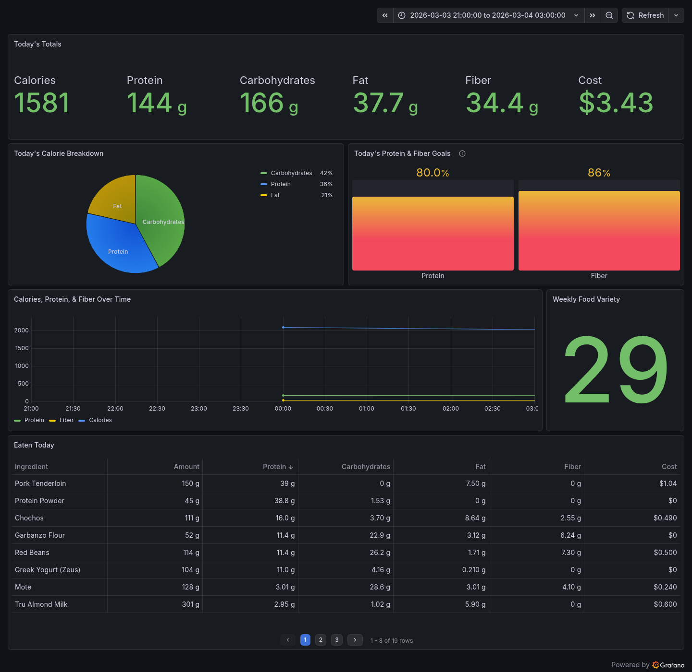

# Gramsly
Serverless macronutrient tracking application.
Requires: iOS Shortcuts + AWS + Grafana Cloud (Free Tier)

## Why I Built This
I needed an easy way to track my daily macros to achieve my fitness goals and answer questions like:
- *"Did I hit my goals for today? (Calories, Protein, Fiber)"*
- *"What is my macro split for today?"*
- *"Am I hitting my goals consistently?"*
- *"Do I have a sufficiently varied diet?"*
- *"What was the cost of my food today?"*
- *"How much does it cost per month to feed myself?"*
- *"What do I eat the most of?"*
- *"What are my top protein sources?"*
- *"How can I reduce what I spend on food, but still hit my protein goal?"*

**Goals**
1. Log expenses from iPhone or Macbook quickly after a meal
2. Build a dashboard to ensure I'm hitting my daily goals, view trends over time, and get insights into my diet




## Architecture
**Logging Food Macro Data**
`log.py` --> dynamodb.put_item() --> DynamoDB --> Stream --> Lambda: Scan DynamoDB, Create JSON object, PUT --> S3

`update_cost.py` --> dynamodb.update_item() --> DynamoDB

`update_cost.py` --> dynamodb.update_item() --> DynamoDB

**Logging Eaten Foods**
iOS Shortcut --> API Gateway --> Lambda: Enrich data --> DynamoDB 

**Visualization Flow** 
Grafana --> Athena --> Lambda (DB Connector) --> DynamoDB


#### iOS Shortcut Setup
1. Install AWS SAM CLI
2. Download `template.yaml`
3. Run `sam deploy --guided` and follow the prompts (replace variable defaults)
4. Get API Key from API Gateway Console
5. Create N iOS Shortcut (As many iOS Shortcuts as you have ingredients)
    - Ask for 'Number' for *AMOUNT*
    - Get Current Date and format it to `yyyyMMdd`
    - Set URL to the SAM output 'ApiBaseUrl' + `/log` --> Something like `https://<api_id>.execute-api.<aws_region>.amazonaws.com/dev/log` or a custom domain
    - Get Contents of URL
        - Headers: `x-api-key: <your_api_key>`
        - Body: `DAY: <formatted_date>, AMOUNT: <ask_for_input>, INGREDIENT: <ingredient_name>`
        - Note: `<ingredient_name>` MUST match the id of the ingredient in DynamoDB
    - Get 'Value' for `message` in Contents of URL
    - Show Output


#### Athena Setup: Athena Federated Query via DynamoDB Connector
1. Deploy DynamoDB Connector
```aws serverlessrepo create-cloud-formation-change-set \
  --application-id arn:aws:serverlessrepo:us-east-1:292517598671:applications/AthenaDynamoDBConnector \
  --stack-name athenaDynamoDBConnector \
  --capabilities CAPABILITY_RESOURCE_POLICY CAPABILITY_IAM \
  --parameter-overrides '[{"Name":"AthenaCatalogName","Value":"dynamo"},{"Name":"SpillBucket","Value":"karl-macro-tracker-athena-spill-bucket"}]'
```

2. Register Connector as Data Catalog in Athena
```ACCOUNT_ID=$(aws sts get-caller-identity --query Account --output text)
REGION=$(aws configure get region)

aws athena create-data-catalog \
  --name dynamo \
  --type LAMBDA \
  --description "DynamoDB Federated Connector" \
  --parameters function=arn:aws:lambda:${REGION}:${ACCOUNT_ID}:function:dynamo
```

3. Create Dashboard & Panels in Grafana

*For large tables queried frequently, it's often cheaper to export DynamoDB data to S3 (via DynamoDB Streams or point-in-time exports) and query from there with Athena at standard S3 rates* --> **Evaluate later to determine if this is necessary. Check Cost Explorer**

---
# TODO
2. Modify API Gateway response to make responses more verbose in iOS Shortcuts, instead of just "Expense logged!"
3. New Graphs
  - Stat: 7-day moving average cost, 30-day moving average cost
  - Cost by category (Dairy, Meat, Fruit, Vegetables, etc.)
  - Cumulative total in KG of consumed ingredients (LIMIT 10;)
  - Spent the most on which ingredients (LIMIT 10;)
  - Top 3 protein sources
  - Top 3 fiber sources

**Sections**
1. Today's macros -- "Am I good for today?" (Calories, protein, fiber) --> **Done**
2. Weekly/monthly trends -- "Am I keeping up a habit?" (Calories, protein, fiber)
3. General data
  - Average distinct food count
  - Average cost (daily, monthly)
  - Top 5 most expensive foods (what I spent the most $ on)
  - Top 5 foods by consumption weight (kg)
  - Top 3 protein sources

